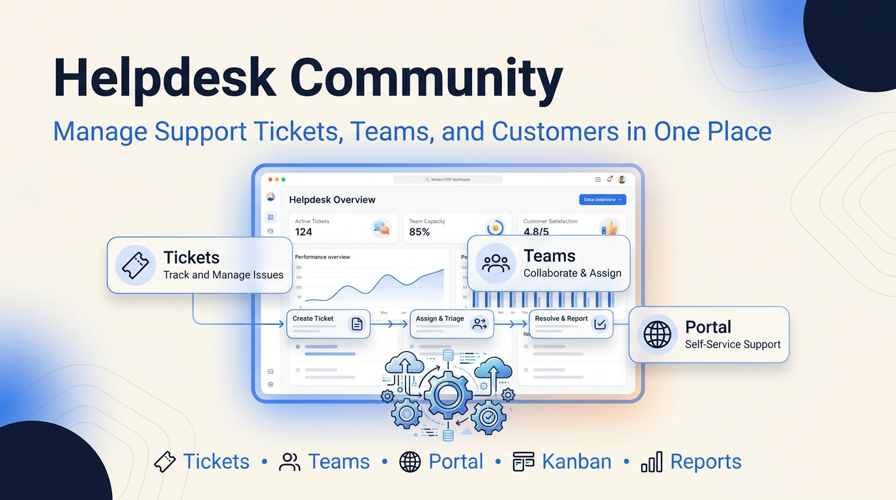
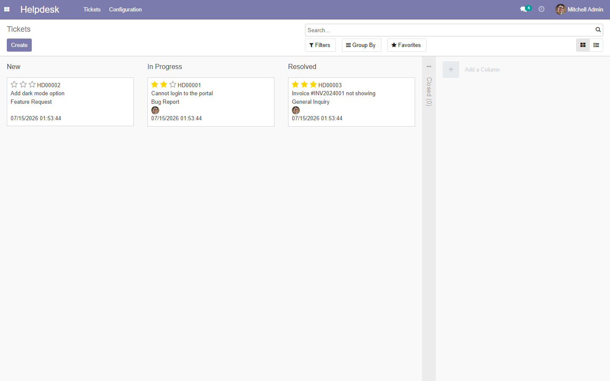
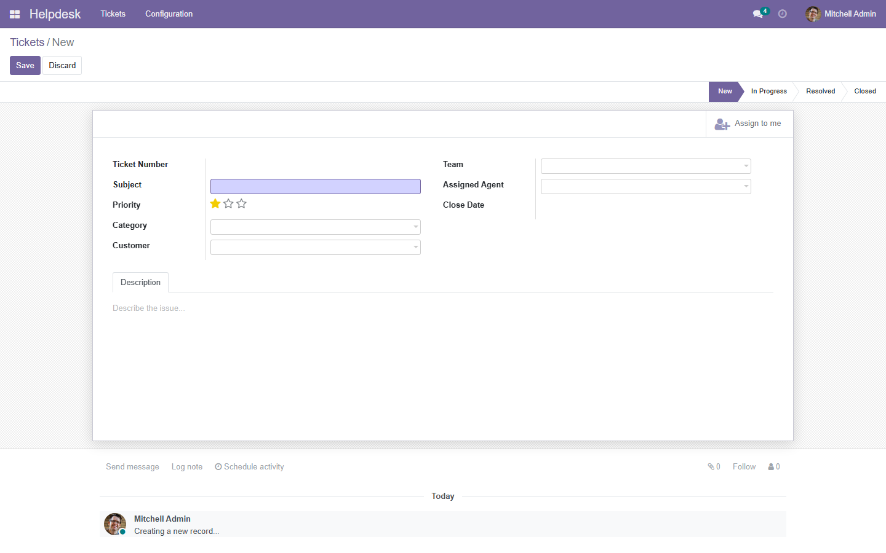
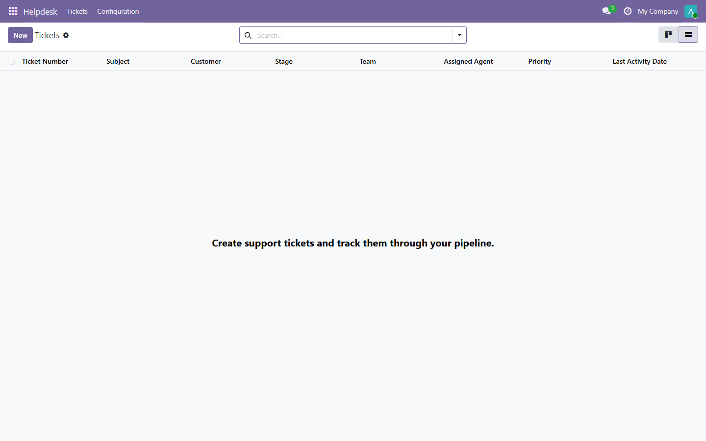
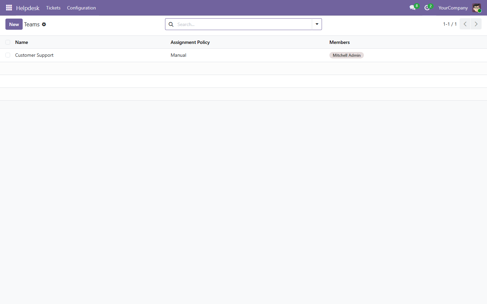
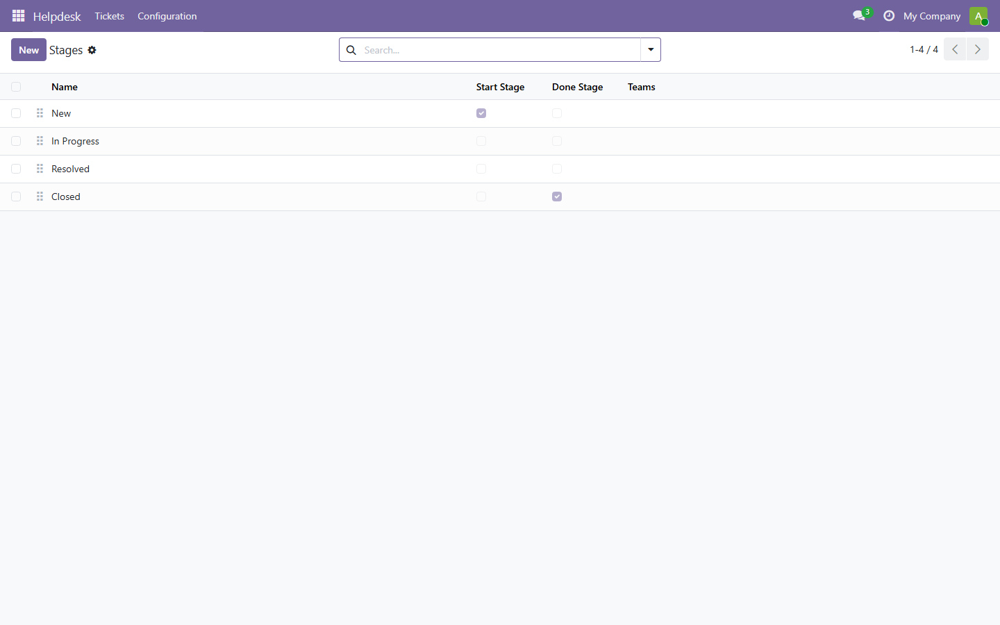
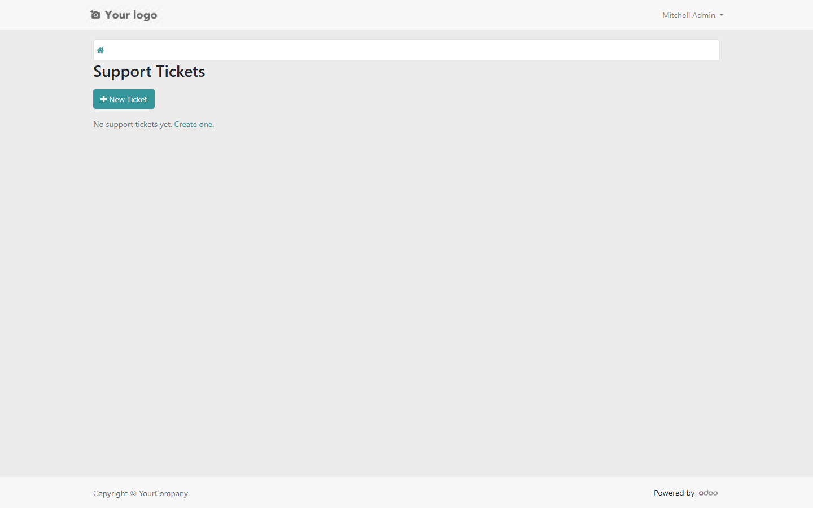
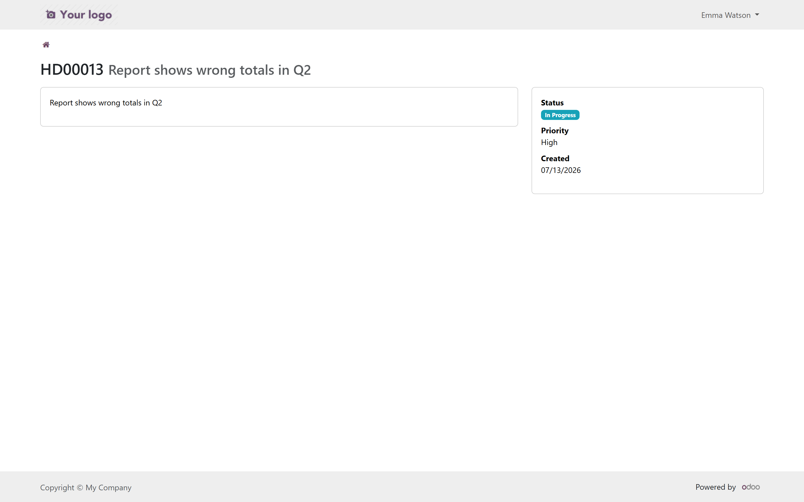
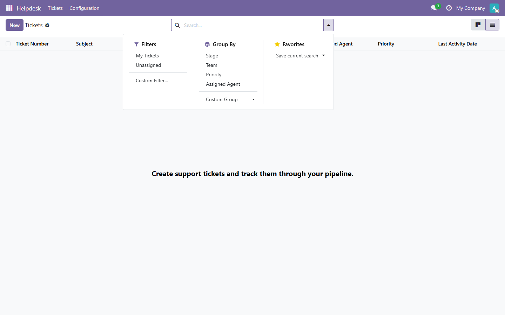
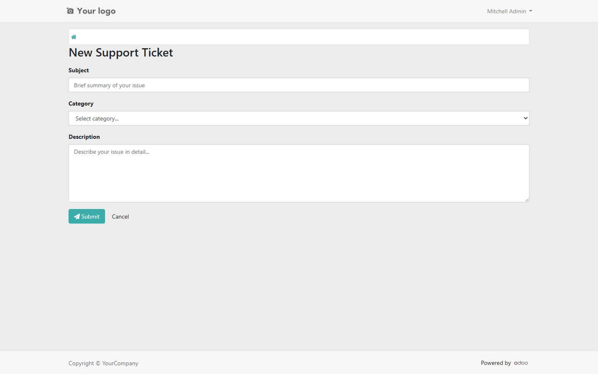

# Helpdesk Community

> Support ticket management for **Odoo 15.0** Community Edition.



**Version:** 15.0.1.0.4 -- **License:** LGPL-3 -- **Publisher:** FoxPink -- Maintained for **Odoo 14.0-19.0** (one validated build per series)

## Features

- **Tickets** -- customizable pipeline (New -> In Progress -> Resolved -> Closed)
- **Teams** -- agents with assignment policies and role-based access
- **Categories** -- classify tickets for reporting and filtering
- **Customer Portal** -- end users can create and track their own tickets
- **Email notifications** -- automatic alerts on assignment and stage changes
- **Kanban view** -- drag-and-drop pipeline management
- **Full search and filter** -- by stage, team, priority, assignee
- **Three-tier access control** -- User / Team Leader / Manager

## Screenshots











## Installation

**Option 1 - Odoo Apps Store:** Download the ZIP for your Odoo version from the [Releases](https://github.com/FoxPinkHQ/helpdesk-community/releases) page, unzip into your addons directory, restart Odoo, and install via Apps.

**Option 2 - Git:**

```bash
git clone -b 15.0 https://github.com/FoxPinkHQ/helpdesk-community addons/helpdesk_community
```

After adding the module, restart Odoo, activate Developer Mode, go to **Apps -> Update Apps List**, search for "Helpdesk Community", and install.

## Configuration

1. **Stages:** Helpdesk -> Configuration -> Stages -- customize your pipeline
2. **Teams:** Helpdesk -> Configuration -> Teams -- create teams and add members
3. **Categories:** Helpdesk -> Configuration -> Categories -- classify tickets
4. Default pipeline: New -> In Progress -> Resolved -> Closed

## Dependencies

- `base` (always)
- `mail` (email notifications)
- `portal` (customer access)
- `web` (kanban views)

## Compatibility

| Odoo Version | Status |
|---|---|
| 15.0 | (check) This branch |
| 15.0 | ✅ This branch |
| 16.0 | [Branch 16.0](https://github.com/FoxPinkHQ/helpdesk-community/tree/16.0) |
| 17.0 | [Branch 17.0](https://github.com/FoxPinkHQ/helpdesk-community/tree/17.0) |
| 18.0 | [Branch 18.0](https://github.com/FoxPinkHQ/helpdesk-community/tree/18.0) |
| 19.0 | [Branch 19.0](https://github.com/FoxPinkHQ/helpdesk-community/tree/19.0) |

Each series has its own git branch and validated release ZIP. Install the build matching your Odoo version.

## Community vs Pro

| Feature | Community | Pro |
|---|---|---|
| Ticket management | Yes | Yes |
| Stages / Pipeline | Yes | Yes |
| Teams and Assignees | Yes | Yes |
| Customer Portal | Yes | Yes |
| Email notifications | Yes | Yes |
| SLA management | -- | Yes |
| Email gateway | -- | Yes |
| Automated actions | -- | Yes |
| Advanced reporting | -- | Yes |
| Time tracking | -- | Yes |

## Support

- **Issues:** [GitHub Issues](https://github.com/FoxPinkHQ/helpdesk-community/issues)
- **Email:** aduy000@gmail.com

## License

**LGPL-3** -- see [LICENSE](helpdesk_community/LICENSE).
